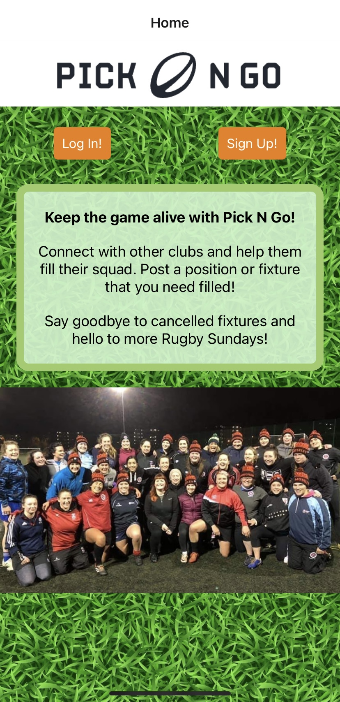
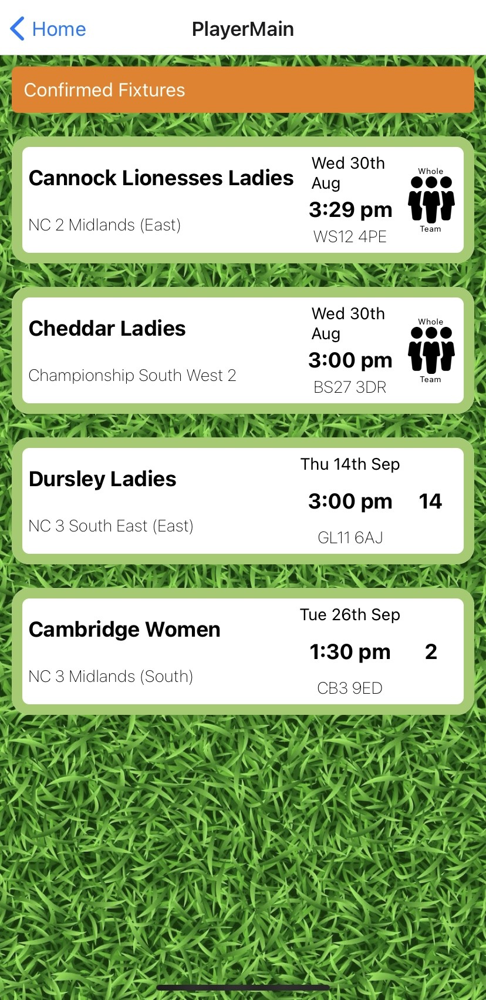
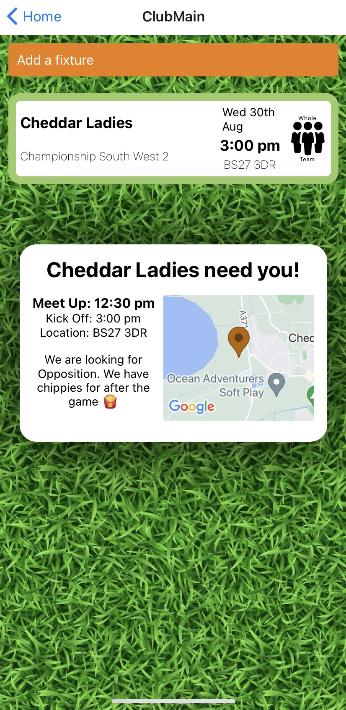

A mobile app designed to keep grass root rugby games happening.
  

  

On sign-up, users can choose to be a player or a club. The results of thier choice are saved in global state so that it can be accessed across the whole app.

The main page includes the pull down to refresh feature which is an essential part of UI in mobile apps.

A club can post a fixture using a form. The data is saved to a Mongo DB with a mongoose ORM.

The fixtures will be shown depending on the type of user (player or club). The fixtures are filtered accordingly.

Each fixture has a pop-up including details of the match location using an intergrated Google Maps API.

Web sockets are used to give a real time alert when a user has signed up to a match.

  

To Install

- download EXPO on your IOS device.
- from the server folder run nodemon
- from the client folder run npx expo start
